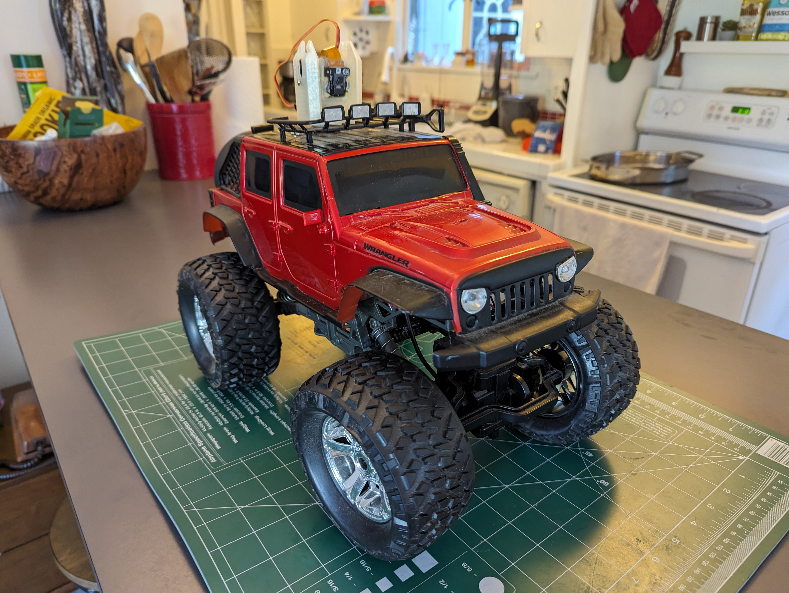
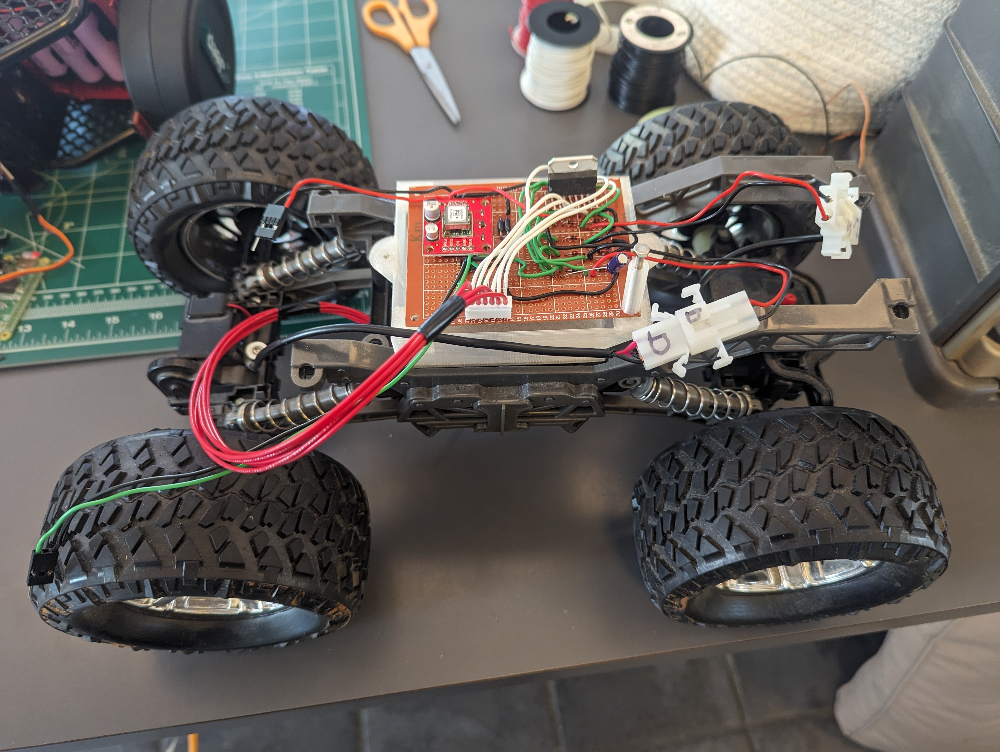

# littlefoot
This is a repo dedicated to documenting the modification of an old remote controlled car to include a Raspberry pi, a camera and some sensors that allow it to be teleoperated over a wifi connection. It serves as a testbed for [IOC](https://github.com/benjamin-edward-morgan/ioc), which I am developing as a more general purpose teleoperation software package. 

So they wouldn't go to waste, this project uses some discontinued parts that I just happened to have lying around. The 3d printed parts also are specific to this particular model of RC car and my modifications to it. As such, this should serve as more of an example to inform future designs, rather than something intended to be reproduced identically.

### Overview 
- **[IOC](https://github.com/benjamin-edward-morgan/ioc)**
The core application is implemented in Rust. It serves up the mjpeg stream, the websocket, and communicates with the i2c devices.
- **[config](config/README.md)**
Contains the config files for IOC. The config file specifies what hardware is attached and how it is controlled. 
- **[littlefoot-ui](littlefoot-ui/README.md)**
A UI implemented in React and TSX. It connects to the websocket and displays the mjpeg stream, sensor outputs and allows driving and looking. Includes a touch UI for touch capable devices, and a keyboard-based interface for desktop.
- **[parts](parts/README.md)**
Openscad design and `.stl` renders for 3d printed parts used in this build.

|  |  |

### Parts list
- 1x old ["New Bright" RC Jeep](https://www.newbright.com/products/rc-heavy-metal-jeep-wrangler/), with exising circuit board removed.
- 1x [Raspberry PI Zero W](https://www.raspberrypi.com/products/raspberry-pi-zero-w/), whith headers soldered on.
- 1x [Raspberry PI Camera V2.1](https://www.raspberrypi.com/products/camera-module-v2/) NoIR and [30cm ribbon rable](https://www.amazon.com/gp/product/B07H3L3LM2/ref=ppx_yo_dt_b_asin_title_o01_s00?ie=UTF8&th=1) for Pi Zero.
- 1x microSD card (overkill at 64gb)
- 3x [18650 batteries](https://www.18650batterystore.com/products/samsung-30q), and [holders](https://www.amazon.com/HiLetgo-10pcs-Battery-Holder-Storage/dp/B00LSG5BKO/ref=sr_1_2_sspa?crid=97216I79OO69&dib=eyJ2IjoiMSJ9.Q-KR7067XcYfRgYTq9TeqxpyT93TtpYyneuiAy5ld9pNV5Jz7SXru3EFWZviGJ45HuykMrFF6-fcu0LeeM2DiYL2OgbSJxO9azyfMVyhMRNHm9egYPnSr4Z1AGL0BJTA5QJdmkTGOP1BnmrubZBUDfC628Fg7I-E1HcPhVd7Wd2Pb2foTTr7ePjyLMi1PtOfDaBA0TiYUR1T2OGXoOcaCoGddefHBYCcTdISMss6mQQ.y_Ch58lsmDYNaHnR8IksA11PggLHZH4FjoZqRQWZFI0&dib_tag=se&keywords=18650+holder&qid=1712461822&sprefix=18650+holder%2Caps%2C162&sr=8-2-spons&sp_csd=d2lkZ2V0TmFtZT1zcF9hdGY&psc=1)
- 1x [battery protection board](https://www.amazon.com/Battery-Protection-Lithium-Charger-Charging/dp/B09B335Q4P/ref=sr_1_18?crid=3MDQG1MV7E97J&dib=eyJ2IjoiMSJ9.91z7aokeaEk9nRcMwQTWrS4CjiEKeDCXgrusYSVrlwbJD-Ks-xIgScZ70qEiiHp7A8AzKRVzTt1rgNvPB2RPPHqigDd6A6x4XUve_X-03LkBseNwhtQLuewfKWnhioy5w3EQfNn6YbVzeqlqCnPdfnKcRVpyTFY7tOjyPzZFPPC2LNHlbMgTxW2As9lhKyv-5nVLRYu2zh8I6Mo7U03kHD8sTvLQaDZck5MZYpaLtyA.1c6__enoEM3_ZK2WM2EgSpTeW7qGjoh5O97IRPRcXPU&dib_tag=se&keywords=3s+battery+protection+board&qid=1712461864&sprefix=3s+bettery+protection%2Caps%2C180&sr=8-18)
- 1x [DC/DC voltage converter](https://www.sparkfun.com/products/9370) and trim resistor(s) to get 5v
- 1x [PCA9685 breakout](https://www.adafruit.com/product/815) (pwm output)
- 1x discontinued [10 DOF board](https://www.adafruit.com/product/1604) with L3GD20H, LSM303, and BMP180
- 1x [L298N dual h-bridge](https://www.sparkfun.com/products/9479)
- 4x LEDs (2 red and 2 white)
- 3S [battery level indicator](https://www.amazon.com/gp/product/B07T5RBF5V/ref=ppx_yo_dt_b_asin_title_o02_s00?ie=UTF8&th=1) 
- DC Barrel jack and [3S Li-Ion charger](https://www.amazon.com/gp/product/B086ZFHVX9/ref=ppx_yo_dt_b_asin_title_o01_s00?ie=UTF8&psc=1)
- Diodes, resistors and a couple capacitors. 
- Perf board, wire, connectors, crimp connectors, hot glue, 3mm nuts and bolts.
- 3d printed brackets for perf boards, pan/tilt mechanism.

### Learnings (so far...)
- The RC car does not have great meanuverability. It has one or two distinct steering radii, and the smallest turning radius is still on the order of 1 meter. This is entirely due to New Bright's design of the steering linkage which limits the steering range.
- The capacitor in parallel with the power supply to the L298N is necessary to protect the chip. Once the RC ran into a wall at full speed without the capacitor and half of the chip was fried. This was a real pain to replace.
- The old Raspberry Pi V2 camera has a decent field of view, but the new wide angle v3 camera would be better.
- You should take care to not push a servo beyond its limit. On another occasion the pan servo (which should only have a 180 degree range) was pushed too far in one direction. The servo unexpectely performed a full rotation, wrapping the ribbon cable around the camera and tilt mechanism until the servo and camera were unplugged. 
- Would be nice to sense the battery voltage. The only way to get a battery reading is to view the indicator on the physical car. 